# Future Vision: Multi-Agent Kubernetes Platform

## The Evolution from K8sAgent to a Comprehensive Multi-Agent Ecosystem

---

## Overview

**Current State (K8sAgent v0.0.4):**
- Single-purpose troubleshooting tool
- 3 core agents: Document, Execution, LLM
- Focused on reactive problem-solving

**Future Vision:**
- **Multi-Agent Platform** where specialized agents collaborate
- **Proactive monitoring** and prevention, not just reactive fixes
- **End-to-end Kubernetes lifecycle management** through AI
- **Autonomous operations** with human oversight

---

## The Multi-Agent Architecture

### Core Philosophy

Instead of one monolithic system, we envision **specialized agents** that:
- Each have deep expertise in one domain
- Communicate and collaborate on complex tasks
- Share knowledge through a central RAG system
- Coordinate through an intelligent orchestrator

Think of it like a **DevOps team where each agent is a specialist:**
- The security agent is your security engineer
- The observability agent is your monitoring expert
- The backup agent is your disaster recovery specialist
- And they all work together seamlessly

---

## The Agent Ecosystem

### 1. **K8sAgent (Troubleshooting Agent)** - *Foundation*

**Role:** Diagnose and fix Kubernetes issues

**Capabilities:**
- Root cause analysis for pod failures
- Performance troubleshooting
- Configuration debugging
- Quick fixes for common issues

**Example:**
```
User: "My pods keep crashing"
K8sAgent: Investigates → Finds missing ConfigMap → Suggests fix
```

---

### 2. **Observability Agent**

**Role:** Monitor cluster health and predict issues before they happen

**Capabilities:**
- Real-time metrics analysis (CPU, memory, disk, network)
- Log aggregation and pattern detection
- Anomaly detection (unusual spikes, degraded performance)
- Predictive alerts ("Pod X will run out of memory in 2 hours")
- Performance trend analysis

**Integration with K8sAgent:**
```
Observability Agent: "Warning: API pod memory usage at 85%, trending up"
K8sAgent: Automatically triggered to investigate
K8sAgent: Finds memory leak in code
Documentation Agent: Provides best practices for memory optimization
```

**Example Scenarios:**
- Detects slow API response times → correlates with database connection pool exhaustion
- Identifies abnormal network traffic patterns → alerts Security Agent
- Predicts disk space exhaustion → triggers Backup Agent cleanup

---

### 3. **Security Agent**

**Role:** Ensure cluster security and compliance

**Capabilities:**
- Vulnerability scanning (images, dependencies, configurations)
- RBAC policy validation and recommendations
- Network policy enforcement checks
- Secret management auditing
- Compliance checking (PCI-DSS, HIPAA, SOC2)
- Security best practices enforcement
- Intrusion detection

**Integration with Other Agents:**
```
Security Agent: "Critical: Pod running as root user"
K8sAgent: Investigates why root access needed
Documentation Agent: Provides security hardening guide
Security Agent: Generates fix (security context configuration)
```

**Example Scenarios:**
- Scans new image → finds CVE-2024-1234 → blocks deployment → suggests patched version
- Detects overly permissive RBAC → recommends least-privilege policy
- Identifies exposed secrets in environment variables → migrates to Kubernetes Secrets

---

### 4. **Registry Agent**

**Role:** Manage container images and registries

**Capabilities:**
- Image vulnerability scanning
- Image optimization (reduce size, remove unused layers)
- Registry synchronization across environments
- Image signing and verification
- Garbage collection of unused images
- License compliance checking
- Image promotion workflows (dev → staging → prod)

**Integration with Other Agents:**
```
Registry Agent: "New image nginx:1.25 available with security patches"
Security Agent: Scans image → Approves
K8sAgent: Updates deployment with new image
Backup Agent: Archives old image version
```

**Example Scenarios:**
- Detects bloated image (2GB) → suggests multi-stage build → reduces to 200MB
- Finds unsigned images in production → enforces image signing policy
- Automatically promotes tested images from staging to production

---

### 5. **Backup Agent**

**Role:** Disaster recovery and data protection

**Capabilities:**
- Automated backup scheduling for PVCs, etcd, configurations
- Point-in-time recovery
- Cross-region replication
- Backup verification and testing
- Retention policy management
- Disaster recovery orchestration
- Application-consistent snapshots

**Integration with Other Agents:**
```
Observability Agent: "Database pod deleted accidentally"
Backup Agent: Triggered for immediate recovery
Backup Agent: Restores from latest backup (5 minutes old)
K8sAgent: Verifies pod health post-recovery
Documentation Agent: Updates runbook with incident details
```

**Example Scenarios:**
- Scheduled backup before major deployment
- Namespace accidentally deleted → full restore in 3 minutes
- Compliance requirement: 7-year retention → automatically archives to cold storage

---

### 6. **Certificate Agent**

**Role:** Manage SSL/TLS certificates and PKI

**Capabilities:**
- Certificate lifecycle management (issue, renew, revoke)
- Automated certificate rotation
- Expiration monitoring and alerts
- Certificate validation and trust chain verification
- Integration with cert-manager, Let's Encrypt, internal CA
- mTLS enforcement for service mesh
- Certificate compliance auditing

**Integration with Other Agents:**
```
Certificate Agent: "Ingress cert expires in 7 days"
Certificate Agent: Auto-renews certificate
K8sAgent: Verifies ingress still functional
Observability Agent: Confirms no traffic disruption
Documentation Agent: Logs renewal event
```

**Example Scenarios:**
- Certificate expires → auto-renewal 30 days before → zero downtime
- New service deployed → automatically provisions mTLS certificates
- Detects weak cipher suites → upgrades to TLS 1.3

---

### 7. **Resolver Agent**

**Role:** DNS, service discovery, and network routing

**Capabilities:**
- DNS resolution troubleshooting
- Service mesh configuration management
- Ingress/egress routing optimization
- Network policy recommendations
- Service dependency mapping
- Traffic splitting and canary deployments
- Load balancing optimization

**Integration with Other Agents:**
```
K8sAgent: "Service A cannot reach Service B"
Resolver Agent: Checks DNS, network policies, service mesh rules
Resolver Agent: Finds misconfigured network policy blocking traffic
Security Agent: Validates fix doesn't create security hole
Resolver Agent: Applies corrected policy
```

**Example Scenarios:**
- DNS lookup fails → identifies CoreDNS misconfiguration → fixes automatically
- High latency between services → recommends service mesh retry policy
- Canary deployment traffic split (10% new version) → monitors → rolls out to 100%

---

### 8. **Documentation Agent (RAG)** - *Enhanced*

**Role:** Centralized knowledge repository for all agents

**Capabilities:**
- RAG-based search across all documentation sources
- Automatic documentation generation from incidents
- Best practices repository
- Runbook creation and maintenance
- Knowledge sharing between agents
- Learning from past incidents
- Natural language query interface

**Integration with Other Agents:**
```
ALL agents query Documentation Agent for:
- Historical incidents ("How did we fix this before?")
- Best practices ("What's the recommended backup frequency?")
- Compliance requirements ("What are PCI-DSS network rules?")
- Internal policies ("What's our image approval process?")
```

**Example Scenarios:**
- K8sAgent solves new issue → Documentation Agent creates runbook automatically
- New engineer asks "How to scale deployment?" → gets step-by-step guide + examples
- Aggregates knowledge from Stack Overflow, K8s docs, internal wikis, Slack history

---

## How Agents Communicate and Collaborate

### Communication Model

**1. Event-Driven Architecture**
- Agents publish events to a central message bus
- Other agents subscribe to relevant events
- Example: "Pod crashed" event triggers K8sAgent, Observability Agent, Documentation Agent

**2. Request-Response Pattern**
- Agent A requests help from Agent B
- Example: K8sAgent asks Security Agent "Is this pod configuration secure?"

**3. Collaborative Problem-Solving**
- Multiple agents work together on complex issues
- Central orchestrator coordinates the workflow

---

### Example: Multi-Agent Collaboration Scenario

#### Scenario: Production API Performance Degradation

```mermaid
sequenceDiagram
    participant Obs as Observability Agent
    participant Bus as Event Bus
    participant K8s as K8sAgent
    participant Doc as Documentation Agent
    participant Reg as Registry Agent
    participant Sec as Security Agent
    participant Back as Backup Agent
    participant Res as Resolver Agent
    
    Note over Obs: Detects API response<br/>time: 100ms → 2000ms
    Obs->>Bus: Event: PERFORMANCE_DEGRADATION
    
    Bus->>K8s: Subscribe: Start investigation
    K8s->>K8s: Check pods, resources, logs
    Note over K8s: Found: DB connection<br/>pool exhausted
    
    K8s->>Doc: Query: Similar incidents?
    Doc-->>K8s: 3 past incidents<br/>Connection leak pattern
    Note over K8s: Root cause: Recent<br/>code deployment
    
    K8s->>Reg: Request: Previous stable image
    Reg-->>K8s: Image: api:v1.2.3
    
    K8s->>Sec: Verify: Image vulnerabilities?
    Sec-->>K8s: ✅ No critical CVEs
    
    K8s->>Back: Request: Pre-rollback snapshot
    Back-->>K8s: ✅ Snapshot created
    
    K8s->>K8s: Execute rollback
    
    K8s->>Res: Monitor: Traffic routing
    Res-->>K8s: ✅ Routing stable
    
    K8s->>Obs: Request: Verify metrics
    Obs-->>K8s: ✅ Response time: 100ms
    
    K8s->>Doc: Create: Incident report
    Doc-->>Doc: Update runbook
    
    Note over K8s,Doc: Total time: 3 minutes<br/>(vs 2 hours manual)
```



**Step 1: Detection**
```
Observability Agent: Detects API response time increased from 100ms to 2000ms
Observability Agent: Publishes "PERFORMANCE_DEGRADATION" event
```

**Step 2: Initial Investigation**
```
K8sAgent: Subscribes to event, starts investigation
K8sAgent: Checks pod health, resource usage, logs
K8sAgent: Finds: Database connection pool exhausted
```

**Step 3: Root Cause Analysis**
```
K8sAgent: Queries Documentation Agent for similar incidents
Documentation Agent: Returns 3 past incidents with same symptoms
K8sAgent: Identifies root cause: Connection leak in recent code deployment
```

**Step 4: Multi-Agent Collaboration**
```
K8sAgent: "Need to rollback deployment"
Registry Agent: Provides previous stable image version
Security Agent: Verifies old image has no critical vulnerabilities
Backup Agent: Takes snapshot before rollback
K8sAgent: Executes rollback
```

**Step 5: Verification**
```
Resolver Agent: Monitors traffic routing during rollback
Observability Agent: Confirms response times back to 100ms
Certificate Agent: Verifies SSL certificates still valid
```

**Step 6: Post-Incident**
```
Documentation Agent: Creates incident report automatically
Documentation Agent: Updates runbook with fix
Observability Agent: Sets up alert for similar patterns in future
```

**Total Time: 3 minutes (vs 2 hours manually)**

---

## Use Cases: Real-World Scenarios

### Use Case 1: Zero-Downtime Certificate Renewal

**Traditional Way:**
1. Engineer notices cert expiring next week
2. Manually generates new cert
3. Schedules maintenance window
4. Updates ingress configuration
5. Monitors for issues
**Time: 4 hours + planned downtime**

**Multi-Agent Way:**
```
Certificate Agent: Auto-detects expiration 30 days out
Certificate Agent: Requests new cert from Let's Encrypt
Security Agent: Validates new cert
Certificate Agent: Stages new cert
Observability Agent: Monitors traffic during rotation
Certificate Agent: Rotates cert during low-traffic period
Resolver Agent: Verifies routing still works
Documentation Agent: Logs renewal event
```
**Time: 2 minutes, zero downtime, zero human intervention**

---

### Use Case 2: Automated Disaster Recovery

**Traditional Way:**
1. Database namespace accidentally deleted
2. Panic ensues
3. Search for backup documentation
4. Manually restore from backup
5. Verify data integrity
6. Rebuild configurations
**Time: 2-4 hours + data loss**

**Multi-Agent Way:**
```
Observability Agent: Detects namespace deletion event
Backup Agent: Immediately triggered
Backup Agent: Restores namespace from latest backup (5 min old)
K8sAgent: Verifies pods are healthy
Resolver Agent: Restores DNS entries
Certificate Agent: Reissues certificates
Security Agent: Re-applies RBAC policies
Documentation Agent: Documents incident and recovery steps
```
**Time: 3 minutes, minimal data loss (5 min)**

---

### Use Case 3: Proactive Security Hardening

**Traditional Way:**
1. Security audit once per quarter
2. Manual review of configurations
3. Create Jira tickets for fixes
4. Weeks to implement changes
**Time: Weeks + manual effort**

**Multi-Agent Way:**
```
Security Agent: Continuous scanning (every 15 minutes)
Security Agent: "Found 12 pods running as root"
K8sAgent: Analyzes each pod's requirements
Documentation Agent: Provides security best practices
Security Agent: Generates security context configs
K8sAgent: Tests changes in staging
Registry Agent: Rebuilds images with non-root user
K8sAgent: Rolls out fixes to production
Observability Agent: Confirms no functionality broken
```
**Time: 30 minutes, automated, continuous**

---

### Use Case 4: Intelligent Auto-Scaling

**Traditional Way:**
1. Set static HPA thresholds
2. Over-provision to be safe
3. Waste resources or suffer outages
**Result: 40% wasted capacity or frequent incidents**

**Multi-Agent Way:**
```
Observability Agent: Learns traffic patterns over 30 days
Observability Agent: Predicts Black Friday traffic spike
K8sAgent: Scales up 2 hours before predicted surge
Registry Agent: Pre-pulls images to nodes
Backup Agent: Takes pre-event snapshot
Observability Agent: Monitors in real-time during event
K8sAgent: Scales down gradually after surge
Documentation Agent: Updates capacity planning docs
```
**Result: Right-sized resources, zero downtime, 25% cost savings**

---

## The Future Platform Architecture

### High-Level View


---

## Agent Communication Patterns

### Pattern 1: Sequential Workflow


### Pattern 2: Parallel Execution


### Pattern 3: Event-Driven Reactive


---

## Benefits of Multi-Agent Architecture

### 1. **Specialization**
- Each agent is expert in its domain
- Deep knowledge vs shallow generalist
- Better accuracy and recommendations

### 2. **Scalability**
- Add new agents without redesigning system
- Agents can run independently or together
- Horizontal scaling (multiple instances per agent)

### 3. **Resilience**
- One agent fails, others continue
- No single point of failure
- Graceful degradation

### 4. **Continuous Learning**
- Agents learn from each interaction
- Share knowledge through Documentation Agent
- Improve over time

### 5. **Autonomous Operations**
- Handle 80% of routine tasks without human input
- Humans focus on strategic decisions
- 24/7 operations

### 6. **Cost Efficiency**
- Reduce manual operations by 90%
- Prevent outages (save $5,600/min)
- Optimize resource usage

---

## Implementation Roadmap

### Phase 1: Foundation (Months 1-3)
- ✅ K8sAgent (current - v0.0.4)
- 🔄 Enhanced Documentation Agent with RAG embeddings
- 🔄 Observability Agent (basic metrics monitoring)
- 🔄 Central orchestrator with event bus

### Phase 2: Core Agents (Months 4-6)
- Security Agent (vulnerability scanning, RBAC)
- Registry Agent (image management)
- Certificate Agent (basic lifecycle management)

### Phase 3: Advanced Agents (Months 7-9)
- Backup Agent (automated DR)
- Resolver Agent (DNS, service mesh)
- Enhanced Observability (predictive analytics)

### Phase 4: Intelligence Layer (Months 10-12)
- Multi-agent collaboration workflows
- Autonomous decision making
- Advanced ML/AI capabilities
- Self-healing infrastructure

### Phase 5: Enterprise Features (Year 2)
- Multi-cloud support
- Compliance automation
- Cost optimization agent
- Capacity planning agent

---

## Technical Considerations

### 1. **Message Bus**
- Technology: Kafka, NATS, RabbitMQ
- Ensures reliable agent communication
- Event replay for debugging

### 2. **RAG System**
- Vector database: Pinecone, Weaviate, or Qdrant
- Embeddings: OpenAI, Sentence Transformers
- Fast semantic search across all agent knowledge

### 3. **LLM Strategy**
- Local (Ollama): Privacy, cost-effective
- Cloud (GPT-4): Advanced reasoning
- Hybrid: Local for routine, cloud for complex

### 4. **State Management**
- Each agent maintains its own state
- Shared state in distributed database
- Event sourcing for audit trail

### 5. **Security**
- mTLS between agents
- RBAC for agent permissions
- Audit logging of all agent actions
- Secrets management integration

---

## Success Metrics

### Operational Metrics
- **MTTR**: Mean Time To Resolution - target: <5 minutes
- **Automation Rate**: % of issues resolved without human intervention - target: 80%
- **Prediction Accuracy**: Observability agent predictions - target: 90%
- **Uptime**: Cluster availability - target: 99.99%

### Business Metrics
- **Cost Savings**: Reduced operational costs - target: $2M/year
- **Engineer Productivity**: Time freed up - target: 40% capacity back
- **Incident Reduction**: Fewer production issues - target: 70% reduction
- **Time to Market**: Faster deployments - target: 10x faster

---

## The Vision: Autonomous Kubernetes

**Imagine a Kubernetes platform that:**

✨ **Self-Heals**: Detects and fixes issues before users notice
✨ **Self-Optimizes**: Continuously improves performance and cost
✨ **Self-Secures**: Identifies and remediates vulnerabilities automatically
✨ **Self-Documents**: Learns from every incident and shares knowledge
✨ **Self-Scales**: Predicts load and adjusts resources proactively

**Human Role Evolution:**
- From: "Firefighting issues 24/7"
- To: "Setting policies and strategic direction"

**Engineers become orchestrators of AI agents, not button-pushers.**

---

## Conclusion

The future of Kubernetes operations is **multi-agent collaboration**. 

K8sAgent is just the beginning - the foundation for a comprehensive platform where specialized AI agents work together to manage the entire Kubernetes lifecycle.

**From reactive troubleshooting to proactive, autonomous infrastructure management.**

---

## Get Involved

This is the vision. Want to help build it?

- **Contribute**: https://github.com/Ram1288/hackathon
- **Current Version**: K8sAgent v0.0.4-prerelease
- **Roadmap**: See issues and milestones
- **Community**: Join discussions on building the future of Kubernetes

**The future is multi-agent. The future is now.**
