# 🏗️ K8sAgent

**Intelligent Kubernetes Troubleshooting Assistant**

K8sAgent is an AI-powered troubleshooting system that combines RAG (Retrieval-Augmented Generation), diagnostic execution, and LLM intelligence to help debug Kubernetes and RHEL systems.

## 🌟 Features

- **🔍 Intelligent Documentation Search (RAG)**: Automatically finds relevant documentation for your issue
- **⚡ Automated Diagnostics**: Runs kubectl commands and system diagnostics
- **🤖 AI-Powered Solutions**: Uses Llama 3.1 to generate step-by-step solutions
- **📊 Pattern Recognition**: Recognizes common K8s issues (CrashLoopBackOff, ImagePullBackOff, OOMKilled, etc.)
- **💻 Multiple Interfaces**: CLI, REST API (under qualification), and UI (yet to do)
- **🔒 Safety First**: Command validation and execution restrictions

## ⚙️ How It Works

### Architecture Overview


### 3-Tier Query Classification System

```mermaid
graph TD
    Query[User Query] --> Intent[Intent Detection]
    
    Intent --> Action[ACTION]
    Intent --> Info[INFORMATIONAL]
    Intent --> Trouble[TROUBLESHOOTING]
    
    Action --> ActionFlow["Execute Commands<br/>10-15 sec"]
    Info --> InfoFlow["Fast Path<br/>Direct Answer<br/>5-10 sec ⚡"]
    Trouble --> TroubleFlow["Full Investigation<br/>Root Cause Analysis<br/>30-60 sec"]
    
    ActionFlow --> ActionResult[Generate → Execute → Summary]
    InfoFlow --> InfoResult[Generate → Execute → Answer]
    TroubleFlow --> TroubleResult[RAG → Investigate → Diagnose]
    
    style Query fill:#e3f2fd,stroke:#1976d2,stroke-width:2px
    style Intent fill:#fff3e0,stroke:#f57c00,stroke-width:2px
    style Action fill:#ffebee,stroke:#c62828,stroke-width:2px
    style Info fill:#e8f5e9,stroke:#2e7d32,stroke-width:2px
    style Trouble fill:#f3e5f5,stroke:#6a1b9a,stroke-width:2px
```



**Tier 1: Informational (Fast Path)** - *5-10 seconds*
- **Keywords**: `who`, `what`, `which`, `show`, `list`, `get`, `describe`
- **User Goal**: Get a quick, direct answer to a simple question.
- **Agent Flow**:
    1.  **Orchestrator** → **LLM Agent**: Generate simple `kubectl` commands.
    2.  **Orchestrator** → **Execution Agent**: Run the commands.
    3.  **Orchestrator** → **LLM Agent**: Summarize the command output into a human-readable answer.
- **Example**: "list pods in default namespace"

**Tier 2: Troubleshooting (Full Investigation)** - *30-60 seconds*
- **Keywords**: `debug`, `fix`, `why`, `error`, `failing`, `broken`
- **User Goal**: Find the root cause of a complex problem.
- **Agent Flow**:
    1.  **Orchestrator** → **Document Agent (RAG)**: Search for similar issues and known patterns.
    2.  **Orchestrator** → **Investigation Agent**: Start an iterative investigation.
    3.  **Investigation Agent** 🔄 (loops):
        - Forms a hypothesis.
        - Uses **LLM Agent** to generate test commands.
        - Uses **Execution Agent** to run them.
        - Analyzes results and refines the hypothesis.
    4.  **Orchestrator** → **LLM Agent**: Synthesize all findings (RAG, investigation steps) into a final, detailed solution.
- **Example**: "debug why pods are failing to start"

**Tier 3: Action (Execute Commands)** - *10-15 seconds*
- **Keywords**: `delete`, `scale`, `create`, `restart`, `patch`
- **User Goal**: Perform a specific action on the cluster.
- **Agent Flow**:
    1.  **Orchestrator** → **LLM Agent**: Generate the required `kubectl` commands to perform the action, including safety checks.
    2.  **Orchestrator** → **Execution Agent**: Run the generated commands.
    3.  **Orchestrator** → **LLM Agent**: Generate a summary of what was done and the outcome.
- **Example**: "scale deployment nginx to 5 replicas"

### Detailed Workflow Diagrams

#### Tier 1: Informational Query (Fast Path)


#### Tier 2: Troubleshooting Query (Full Investigation)

```mermaid
sequenceDiagram
    participant User
    participant Orchestrator
    participant Doc as Document Agent
    participant Invest as Investigation Agent
    participant LLM as LLM Agent
    participant Exec as Execution Agent
    
    User->>Orchestrator: "debug why pods are failing"
    Orchestrator->>Orchestrator: Classify as TROUBLESHOOTING
    Orchestrator->>Doc: Search documentation
    Doc-->>Orchestrator: Relevant docs + patterns
    Orchestrator->>Invest: Start investigation
    loop Iterative Analysis
        Invest->>LLM: Generate hypothesis + test commands
        LLM-->>Invest: Diagnostic commands
        Invest->>Exec: Execute diagnostics
        Exec-->>Invest: Results
        Invest->>Invest: Analyze & refine hypothesis
    end
    Invest-->>Orchestrator: Root cause identified
    Orchestrator->>LLM: Generate comprehensive solution
    LLM-->>Orchestrator: Step-by-step fix
    Orchestrator-->>User: "Root cause: ... Solution: ..."
    Note over User,Orchestrator: ⏱️ 30-60 seconds
```



#### Tier 3: Action Query (Execute Commands)


📖 **[View Complete Workflow Documentation](docs/3_TIER_CLASSIFICATION_WORKFLOW.md)**

---

## 🚀 Quick Start

### Prerequisites

- Python 3.8+
- `git` for cloning the repository
- `curl` for installing Ollama (if not already installed)
- `kubectl` (optional, for full Kubernetes integration)

### Installation

The setup script automates the entire installation process.

```bash
# 1. Clone the repository
git clone <repository-url>
cd k8sagent

# 2. Run the interactive setup script
# This will check prerequisites, install dependencies, and help set up Ollama.
chmod +x scripts/setup.sh
./scripts/setup.sh
```

The script will guide you through:
- ✅ Verifying prerequisites (`python3`, `pip3`, `kubectl`).
- 📦 Installing required Python packages.
- 🤖 Installing `Ollama` and pulling the `llama3.1:8b` model.
- 🚀 Creating a `./k8sagent.sh` wrapper for easy access.

### Post-Installation: Start Ollama

Before running the application, make sure the Ollama service is running in a separate terminal:

```bash
ollama serve
```

### Quick Test

```bash
# Option 1: Using the wrapper script
./k8sagent.sh troubleshoot --query "My pod is in CrashLoopBackOff"

# Option 2: Direct Python
python3 integrations/standalone.py troubleshoot --query "My pod is crashing"

# Option 3: Interactive mode
./k8sagent.sh interactive
```

## 💻 Usage Examples

### CLI Interface

#### Single Query

```bash
# Basic troubleshooting
python3 integrations/standalone.py troubleshoot \
  --query "My pod is in CrashLoopBackOff state" \
  --namespace production

# With specific pod
python3 integrations/standalone.py troubleshoot \
  --query "Pod keeps restarting" \
  --namespace default \
  --pod api-server-xyz
```

#### Interactive Mode

```bash
python3 integrations/standalone.py interactive

# Special commands in interactive mode:
# /namespace <name>  - Change namespace
# /clear            - Clear session
# /health           - Check system health
# exit or quit      - Exit
```

#### Health Check

```bash
python3 integrations/standalone.py health
```

### REST API

#### Start the API Server

```bash
python3 integrations/rest_api.py

# Or with uvicorn
uvicorn integrations.rest_api:app --reload --port 8000
```

#### API Endpoints

```bash
# Query endpoint
curl -X POST "http://localhost:8000/query" \
  -H "Content-Type: application/json" \
  -d '{
    "query": "My pod is in CrashLoopBackOff",
    "namespace": "default"
  }'

# Health check
curl http://localhost:8000/health

# Get examples
curl http://localhost:8000/examples

# API documentation (Swagger UI)
# Visit: http://localhost:8000/docs
```

## 📚 Example Queries

Here are some example queries you can try:

```bash
# Pod Issues
"My pod is in CrashLoopBackOff"
"ImagePullBackOff error on deployment"
"Pod keeps getting OOMKilled"
"Pod is stuck in Pending state"

# Cluster Diagnostics
"Show me all failing pods in production"
"Check node resource usage"
"What warning events happened recently?"

# Code Generation
"Generate a Python script to list all pods with resource limits"
"Write kubectl commands to troubleshoot networking"
"Show me how to check pod logs in Python"

# Log Analysis
"Analyze these logs and identify the issue"
"What's wrong with my application logs?"
```

## 📁 Project Structure

```
k8sagent/
├── core/
│   ├── __init__.py
│   ├── interfaces.py          # Base agent interfaces
│   └── orchestrator.py        # Main orchestration engine
├── agents/
│   ├── __init__.py
│   ├── document_agent.py      # RAG document search
│   ├── execution_agent.py     # K8s diagnostics
│   ├── llm_agent.py           # Ollama LLM interface
│   ├── investigator_agent.py  # Pattern recognition and iterative analysis
│   └── investigation_agent.py # AI-driven iterative troubleshooting
├── integrations/
│   ├── standalone.py          # CLI interface
│   ├── rest_api.py           # REST API
│   └── kagent_plugin.py      # kAgent integration (future)
├── docs/
│   └── k8s_troubleshooting.md # Sample documentation
├── config.yaml               # Configuration
├── requirements.txt          # Python dependencies
├── setup.sh                 # Setup script
└── README.md               # This file
```

## ⚙️ Configuration

Edit `config.yaml` to customize:

```yaml
# Document Agent
document_agent:
  doc_dir: ./docs

# Execution Agent
execution_agent:
  ssh_enabled: false
  kubeconfig_path: ~/.kube/config

# LLM Agent
llm_agent:
  ollama_url: http://localhost:11434
  model: llama3.1:8b
  temperature: 0.7

# Orchestrator
orchestrator:
  max_session_history: 100
  session_timeout: 3600
```

## 🔧 Adding Custom Documentation

Add your own troubleshooting guides to the `docs/` directory:

```bash
# Create a new documentation file
cat > docs/my_custom_guide.md << EOF
# My Custom Troubleshooting Guide

## Issue: Custom Application Error

**Diagnosis:**
\`\`\`bash
kubectl logs my-app -n namespace
\`\`\`

**Solution:**
1. Check configuration
2. Restart the pod

\`\`\`python
from kubernetes import client, config
config.load_kube_config()
v1 = client.CoreV1Api()
# Your Python code here
\`\`\`
EOF
```

The Document Agent will automatically index and search these files!

## 🎯 Key Components

### 1. Document Agent (RAG)
- Indexes Markdown documentation
- Keyword-based search
- Extracts code examples (Python & kubectl)
- Recognizes K8s patterns

### 2. Execution Agent
- Runs kubectl commands safely
- Executes system diagnostics
- Supports SSH for remote execution
- Command validation for security

### 3. LLM Agent
- Interfaces with Ollama (Llama 3.1)
- Multiple prompt templates:
  - Troubleshooting
  - Log analysis
  - Code generation
  - Explanation
  - Optimization
- Fallback mode when LLM unavailable

### 4. Investigator Agent
- Recognizes known issue patterns (e.g., CrashLoopBackOff)
- Guides the investigation process based on initial findings
- Determines when a root cause has likely been found

### 5. Investigation Agent
- Performs AI-driven, iterative troubleshooting
- Generates hypotheses and validation commands
- Maintains investigation state and confidence scores

### 6. Orchestrator
- Coordinates all agents
- Maintains session context
- Implements the RAG → Execute → LLM pipeline
- Manages session context and history

## 🔒 Security Features

- Command validation and forbidden patterns
- No destructive operations by default
- Configurable allowed commands
- SSH key-based authentication
- No storage of sensitive data

## 🐛 Troubleshooting

### Ollama Connection Issues

```bash
# Check if Ollama is running
curl http://localhost:11434/api/tags

# Start Ollama
ollama serve

# Check model availability
ollama list
```

### kubectl Not Found

```bash
# The system works without kubectl but with limited functionality
# Install kubectl: https://kubernetes.io/docs/tasks/tools/

# Verify kubectl
kubectl version --client
```

### Agent Initialization Errors

```bash
# Run health check
python3 integrations/standalone.py health

# Check configuration
cat config.yaml

# Verify Python dependencies
pip3 install -r requirements.txt
```

## 🚀 Future Enhancements

- [ ] UI integration (yet to do)
- [ ] REST API qualification (under qualification)
- [ ] Semantic search with embeddings
- [ ] Real-time monitoring dashboard
- [ ] Multi-cluster support
- [ ] Custom plugin system
- [ ] Historical issue tracking
- [ ] Automated fix application
- [ ] Integration with ticketing systems

## 🤝 Contributing

This is a hackathon project! Feel free to:
- Add more documentation to `docs/`
- Improve agent logic
- Add new prompt templates
- Enhance the CLI/API interfaces

## 📝 License

MIT License - Feel free to use and modify!

## 🎓 Hackathon Demo Tips

### Quick Demo Script

```bash
# 1. Start with a simple query
./k8sagent.sh troubleshoot --query "Pod in CrashLoopBackOff"

# 2. Show interactive mode
./k8sagent.sh interactive
> My pod keeps restarting
> Generate Python script to check pod health

# 3. Demonstrate API
python3 integrations/rest_api.py &
curl -X POST http://localhost:8000/query -H "Content-Type: application/json" \
  -d '{"query": "OOMKilled error"}'

# 4. Show health check
./k8sagent.sh health
```

### Key Talking Points

1. **Three-Agent Architecture**: RAG + Execution + LLM working together
2. **Smart Pattern Recognition**: Automatically recognizes common K8s issues
3. **Multiple Interfaces**: CLI, API, ready for kAgent
4. **Production-Ready**: Modular, configurable, secure
5. **Extensible**: Easy to add new documentation and agents

## 📧 Contact

Created for the Hackathon 2024

---

## 🔮 Future Vision: Multi-Agent Platform

K8sAgent is just the beginning. Our vision is a comprehensive **Multi-Agent Kubernetes Platform** where specialized AI agents collaborate to manage the entire Kubernetes lifecycle.

### The Multi-Agent Ecosystem


### Specialized Agents

**🔍 Observability Agent**
- Real-time metrics analysis and anomaly detection
- Predictive alerts ("Pod will run out of memory in 2 hours")
- Performance trend analysis

**🔒 Security Agent**
- Vulnerability scanning and compliance checking
- RBAC policy validation
- Secret management auditing

**📦 Registry Agent**
- Image vulnerability scanning and optimization
- Registry synchronization
- Image signing and verification

**💾 Backup Agent**
- Automated backup scheduling and disaster recovery
- Point-in-time recovery
- Cross-region replication

**🔐 Certificate Agent**
- Certificate lifecycle management
- Automated certificate rotation
- Expiration monitoring and alerts

**🌐 Resolver Agent**
- DNS and service discovery troubleshooting
- Service mesh configuration
- Traffic splitting and canary deployments

**📚 Documentation Agent (Enhanced RAG)**
- Centralized knowledge repository
- Automatic documentation generation from incidents
- Learning from past incidents

### Multi-Agent Collaboration Example

**Scenario: Production API Performance Degradation**

```mermaid
sequenceDiagram
    participant Obs as Observability Agent
    participant Bus as Event Bus
    participant K8s as K8sAgent
    participant Doc as Documentation Agent
    participant Reg as Registry Agent
    participant Sec as Security Agent
    participant Back as Backup Agent
    
    Note over Obs: Detects API response<br/>time: 100ms → 2000ms
    Obs->>Bus: Event: PERFORMANCE_DEGRADATION
    
    Bus->>K8s: Subscribe: Start investigation
    K8s->>K8s: Check pods, resources, logs
    Note over K8s: Found: DB connection<br/>pool exhausted
    
    K8s->>Doc: Query: Similar incidents?
    Doc-->>K8s: 3 past incidents<br/>Connection leak pattern
    Note over K8s: Root cause: Recent<br/>code deployment
    
    K8s->>Reg: Request: Previous stable image
    Reg-->>K8s: Image: api:v1.2.3
    
    K8s->>Sec: Verify: Image vulnerabilities?
    Sec-->>K8s: ✅ No critical CVEs
    
    K8s->>Back: Request: Pre-rollback snapshot
    Back-->>K8s: ✅ Snapshot created
    
    K8s->>K8s: Execute rollback
    
    Note over K8s,Doc: Total time: 3 minutes<br/>(vs 2 hours manual)
```



### Communication Patterns

**Sequential Workflow:**


**Parallel Execution:**


**Event-Driven Reactive:**


### The Vision: Autonomous Kubernetes

**Imagine a platform that:**
- ✨ **Self-Heals**: Detects and fixes issues before users notice
- ✨ **Self-Optimizes**: Continuously improves performance and cost
- ✨ **Self-Secures**: Identifies and remediates vulnerabilities automatically
- ✨ **Self-Documents**: Learns from every incident and shares knowledge
- ✨ **Self-Scales**: Predicts load and adjusts resources proactively

**From reactive troubleshooting to proactive, autonomous infrastructure management.**

📖 **[Read Full Multi-Agent Vision](FUTURE_MULTI_AGENT_VISION.md)**

---

**Happy Troubleshooting! 🚀**
